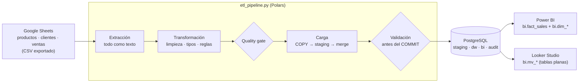
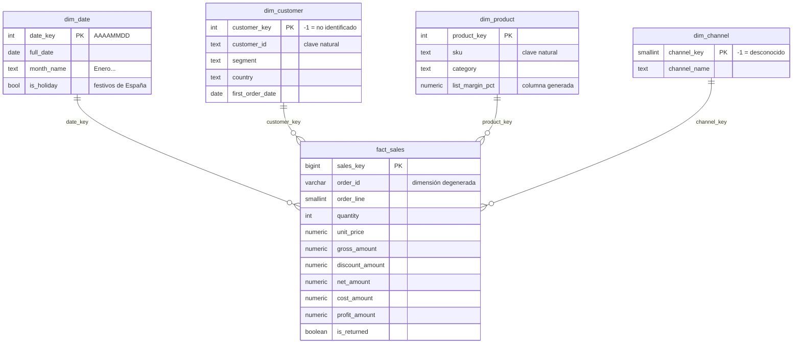

# Motor Analítico de Ventas

**Google Sheets → Polars → PostgreSQL (Star Schema) → Power BI / Looker Studio**

Pipeline de datos end-to-end, reproducible y probado:

1. **Genera** un dataset sintético realista que simula los exports CSV de Google Sheets. Son 75.000 líneas de venta con la suciedad habitual de una hoja editada a mano.
2. **Limpia y normaliza** los datos con Polars.
3. **Carga** el resultado en un modelo en estrella de PostgreSQL con `COPY` y *merge* set-based, validando al céntimo antes de publicar.
4. **Expone una capa BI**: vistas para Power BI, tablas planas materializadas para Looker Studio y las 10 medidas DAX críticas ([BI_MEASURES.md](BI_MEASURES.md)).



---

## Índice

1. [Puesta en marcha](#1-puesta-en-marcha)
2. [Parámetros de conexión para Power BI y Looker Studio](#2-parámetros-de-conexión-para-power-bi-y-looker-studio)
3. [Estructura del proyecto](#3-estructura-del-proyecto)
4. [Los datos de origen (simulación de Google Sheets)](#4-los-datos-de-origen-simulación-de-google-sheets)
5. [El pipeline ETL](#5-el-pipeline-etl)
6. [Modelo de datos](#6-modelo-de-datos)
7. [Capa BI](#7-capa-bi)
8. [Calidad, validación y tests](#8-calidad-validación-y-tests)
9. [Rendimiento](#9-rendimiento)
10. [Operación en producción](#10-operación-en-producción)
11. [Solución de problemas](#11-solución-de-problemas)

---

## 1. Puesta en marcha

**Requisitos:** Python 3.11 a 3.14 y PostgreSQL ≥ 13 (probado con Python 3.11 y PostgreSQL 16.13). Las versiones fijadas de NumPy y SQLAlchemy no admiten Python 3.10. En Windows, Power BI Desktop se instala aparte; `psql` es opcional.

### 1.1 Entorno Python

```bash
# Linux / macOS
python3 -m venv .venv
source .venv/bin/activate
pip install -r requirements-dev.txt      # polars, psycopg2-binary, SQLAlchemy, numpy (+ pytest)
```

```powershell
# Windows (PowerShell)
py -m venv .venv
.venv\Scripts\Activate.ps1
pip install -r requirements-dev.txt
```

### 1.2 Configuración (`.env`)

```bash
cp .env.example .env          # Windows: copy .env.example .env
```

Edita `.env` y define al menos `DW_PASSWORD`, `BI_READER_PASSWORD` y las credenciales del superusuario (`PG_ADMIN_*`). `.env` está en `.gitignore`: las contraseñas no se versionan.

| Variable | Por defecto | Uso |
|----------|-------------|-----|
| `DW_HOST` / `DW_PORT` | `localhost` / `5432` | Servidor PostgreSQL |
| `DW_DATABASE` | `analytics_dw` | Base de datos del modelo |
| `DW_USER` / `DW_PASSWORD` | `etl_user` / — | Rol propietario del modelo (lo usa el ETL) |
| `DW_SSLMODE` | `prefer` | `disable`, `require`, `verify-full`… |
| `BI_READER_PASSWORD` | — | Contraseña del rol de solo lectura `bi_reader` (Power BI / Looker Studio) |
| `PG_ADMIN_USER` / `PG_ADMIN_PASSWORD` / `PG_ADMIN_HOST` | `postgres` / — / `DW_HOST` | Superusuario, solo para `setup_database.py` |

### 1.3 Base de datos, datos y carga (tres comandos)

```bash
python setup_database.py      # una vez: crea los roles etl_user y bi_reader y la BD analytics_dw
python generate_data.py       # genera data/raw/{productos,clientes,ventas}.csv (+ _manifest.json)
python etl_pipeline.py        # init.sql + ETL + capa BI + validaciones
```

Resultado esperado (resumen final del pipeline):

```text
RESUMEN  ejecución #1  |  estado: SUCCESS  |  4.42 s
Extraídas   : productos 462 | clientes 8,087 | ventas 75,924
Rechazadas  : productos 2 | clientes 2 | ventas 535  -> audit.rejected_record y data/rejected/
Hechos      : 72,728 líneas en dw.fact_sales (+72,728 nuevas, 0 actualizadas, 0 eliminadas)
Validaciones:
  [OK ] filas_hechos               dw.fact_sales=72,728 | filas válidas en origen=72,728
  [OK ] importes_al_centimo        neto BD=11,501,380.25 | neto origen=11,501,380.25 | ...
  [OK ] integridad_referencial     hechos huérfanos=0
  ...
  [OK ] manifiesto_generador       resultado idéntico al esperado por generate_data.py
  [OK ] capa_bi_sincronizada       bi.mv_sales_flat=72,728 filas, neto=11,501,380.25
  [OK ] permisos_bi_reader         lee bi=True | lee dw=False (esperado: True | False)
```

`init.sql` también puede ejecutarse a mano, porque es idempotente y no destructivo:

```bash
psql -h localhost -U etl_user -d analytics_dw -v ON_ERROR_STOP=1 -f sql/init.sql
```

> **Linux con autenticación *peer*:** si el superusuario `postgres` no tiene contraseña, usa el socket local: `PG_ADMIN_HOST=/var/run/postgresql` en `.env` y `sudo -u postgres .venv/bin/python setup_database.py`. El usuario `postgres` debe poder leer el `.env`.

### 1.4 Comprobación rápida

```bash
pytest                                                              # 77 tests (los de BD necesitan --with-test-db)
psql -h localhost -U bi_reader -d analytics_dw -f sql/kpi_validation.sql   # KPIs de referencia
```

---

## 2. Parámetros de conexión para Power BI y Looker Studio

Ambas herramientas se conectan con el rol **`bi_reader`**:
* Solo ve el esquema **`bi`**. Recibe `permission denied` en `dw`, `staging` y `audit`.
* Sus sesiones son de **solo lectura**: `default_transaction_read_only = on`.
* Tiene un `statement_timeout` de 120 s.
* Su `search_path` es `bi, public`.
* Las vistas no exponen datos personales (email y teléfono).

| Parámetro | Power BI Desktop (misma máquina) | Looker Studio (servicio en la nube de Google) |
|-----------|----------------------------------|-----------------------------------------------|
| Servidor / Host | `localhost` (o `localhost:5432`) | IP pública, DNS o túnel TCP hacia tu PostgreSQL (ver 2.2) |
| Puerto | `5432` | `5432`, o el puerto del túnel |
| Base de datos | `analytics_dw` | `analytics_dw` |
| Usuario | `bi_reader` | `bi_reader` |
| Contraseña | `BI_READER_PASSWORD` de tu `.env` | ídem |
| Esquema a usar | `bi` (vistas en estrella) | `bi` (vistas materializadas `mv_*`) |
| Cifrado | Ver 2.1 | *Enable SSL* recomendado (obligatorio si expones la BD) |
| Modo | Importar (recomendado) o DirectQuery | Conexión directa (en vivo) |

### 2.1 Power BI Desktop

1. **Inicio → Obtener datos → Base de datos PostgreSQL**. Power BI Desktop incluye el proveedor Npgsql desde 2019, así que no hay que instalar nada.
2. *Servidor*: `localhost:5432` · *Base de datos*: `analytics_dw` · *Modo de conectividad*: **Importar**.
3. Credenciales, en la pestaña **Base de datos**: `bi_reader` y su contraseña.
4. En el navegador marca `bi.fact_sales`, `bi.dim_date`, `bi.dim_customer`, `bi.dim_product` y `bi.dim_channel`, y renómbralas a `Fact_Sales`, `Dim_Date`, `Dim_Customer`, `Dim_Product` y `Dim_Channel`.
5. Sigue la [preparación del modelo de BI_MEASURES.md](BI_MEASURES.md#1-preparación-del-modelo-en-power-bi-imprescindible): relaciones, **marcar `Dim_Date` como tabla de fechas** y ordenaciones. Después añade las medidas con el script de la sección 4 de ese documento.

Alternativa en Power Query (*Consulta en blanco → Editor avanzado*), una consulta por tabla. Cambia `Item` y el nombre de la consulta:

```powerquery
let
    Origen = PostgreSQL.Database("localhost:5432", "analytics_dw"),
    Fact_Sales = Origen{[Schema = "bi", Item = "fact_sales"]}[Data]
in
    Fact_Sales
```

**Cifrado.** Power BI intenta conectar con SSL y valida el certificado del servidor. Si PostgreSQL no tiene SSL, o usa un certificado autofirmado (el *snakeoil* de Ubuntu, por ejemplo), aparece un error de certificado. Tienes dos opciones:
* instalar la CA del servidor en *Entidades de certificación raíz de confianza* de Windows, o
* solo en local, desmarcar **"Cifrar conexiones"** en *Archivo → Opciones → Configuración de origen de datos → Editar permisos*.

**Servicio Power BI (refresco programado):** publica el informe e instala un [On-premises data gateway](https://learn.microsoft.com/es-es/data-integration/gateway/service-gateway-onprem) en una máquina que alcance la base de datos. Desde la versión de junio de 2025 el gateway ya incluye Npgsql. En *Importar* no hacen falta más cambios; *DirectQuery* también funciona a través del gateway. Referencia: [conector PostgreSQL de Power Query](https://learn.microsoft.com/es-es/power-query/connectors/postgresql).

### 2.2 Looker Studio

Looker Studio se ejecuta en los servidores de Google: **no puede conectarse a `localhost`**. La base de datos tiene que ser accesible desde Internet. Hay tres opciones:

| Opción | Cuándo | Qué hacer |
|--------|--------|-----------|
| **A. Base de datos gestionada** (Cloud SQL, Neon, Supabase, RDS…) | Producción | Ejecuta `setup_database.py` y el ETL contra esa instancia y autoriza las IP de Google (abajo) |
| **B. Servidor propio expuesto** | Servidor on-premise con IP fija | Abre el puerto en el firewall **solo** a las IP de Google y activa SSL (ver configuración) |
| **C. Túnel TCP** (p. ej. `ngrok tcp 5432`) | Demos y desarrollo | Usa como host y puerto los que da el túnel (`0.tcp.eu.ngrok.io:12345`) |

Pasos en Looker Studio:

1. **Crear → Fuente de datos → PostgreSQL**.
2. Rellena *Nombre de host o IP*, *Puerto*, *Base de datos* (`analytics_dw`), *Nombre de usuario* (`bi_reader`) y *Contraseña*. Marca **Habilitar SSL** si el servidor lo tiene activo; si usas certificados propios, sube el certificado de la CA del servidor.
3. Elige la tabla **`mv_sales_flat`** (esquema `bi`). Si tu conector no lista el esquema `bi`, usa **CONSULTA PERSONALIZADA** con `SELECT * FROM bi.mv_sales_flat`.
4. Repite para `mv_kpi_monthly`, `mv_customer_cohort`, `mv_customer_rfm` y `v_product_performance` según el panel (ver [sección 7](#7-capa-bi)).

**IP de Looker Studio que hay que permitir** (opciones A y B), según la [documentación oficial del conector PostgreSQL](https://cloud.google.com/looker/docs/studio/connect-to-postgresql). Compruébalas allí antes de configurar, porque Google puede cambiarlas:

* `142.251.74.0/23` y, en IPv6 (opcional), `2001:4860:4807::/48`
* Con residencia de datos (Looker Studio Pro): `142.251.56.0/24` y `2001:4860:4815::/48`

Configuración de PostgreSQL para la opción B:

```ini
# postgresql.conf
listen_addresses = '*'
ssl = on
ssl_cert_file = '/etc/ssl/certs/tu_servidor.crt'
ssl_key_file  = '/etc/ssl/private/tu_servidor.key'
```

```text
# pg_hba.conf — solo bi_reader, solo por SSL y solo desde las IP de Looker Studio
hostssl  analytics_dw  bi_reader  142.251.74.0/23      scram-sha-256
hostssl  analytics_dw  bi_reader  2001:4860:4807::/48  scram-sha-256
```

Después: `SELECT pg_reload_conf();` (o reinicia si cambiaste `listen_addresses`). Con un túnel (opción C), PostgreSQL ve las conexiones como locales (`127.0.0.1`), así que la regla `host ... 127.0.0.1/32 scram-sha-256` que ya existe es suficiente. El túnel, sin embargo, expone el puerto a Internet: usa una contraseña fuerte y ciérralo al terminar.

---

## 3. Estructura del proyecto

```text
.
├── generate_data.py          # Hito 1 · genera los "exports de Google Sheets" + _manifest.json
├── setup_database.py         # Hito 2 · roles (etl_user, bi_reader) y base de datos
├── etl_pipeline.py           # Hito 3 · orquestador CLI del ETL
├── analytics_engine/
│   ├── config.py             #   parámetros de conexión (.env / variables de entorno)
│   ├── cleaning.py           #   expresiones Polars para limpiar datos de hojas de cálculo
│   ├── transform.py          #   reglas por hoja + dimensión fecha (festivos de España)
│   ├── load.py               #   COPY + merge set-based + disyuntor + modo bulk + capa BI
│   ├── validate.py           #   validaciones write-audit-publish
│   └── db.py                 #   ejecución de scripts SQL y COPY desde Polars
├── sql/
│   ├── init.sql              # Hito 2 · Star Schema (idempotente)
│   ├── bi_views.sql          # Hito 4 · vistas y vistas materializadas para BI
│   └── kpi_validation.sql    #         equivalente SQL de las medidas DAX
├── BI_MEASURES.md            # Hito 4 · 10 medidas DAX críticas + valores de referencia
├── tests/                    # 77 tests: unitarios, transformación e integración con PostgreSQL
├── requirements*.txt · pyproject.toml · .env.example
└── data/                     # (no versionado) raw/ y rejected/
```

---

## 4. Los datos de origen (simulación de Google Sheets)

`generate_data.py` crea tres "pestañas" exportadas a CSV, igual que *Archivo → Descargar → CSV* en Google Sheets:

| Hoja | Filas (por defecto) | Contenido |
|------|--------------------:|-----------|
| `productos.csv` | 462 | 450 SKU en 6 categorías y 18 subcategorías, con precio de tarifa y coste estándar |
| `clientes.csv` | 8.087 | 8.000 clientes de España y LATAM, con segmento, geografía, fecha de alta y consentimiento de marketing |
| `ventas.csv` | 75.924 | **75.000 líneas de pedido** (~41.600 pedidos) entre el 01/01/2023 y el 31/08/2026 |

**Coherencia de negocio.**
* Crecimiento interanual y estacionalidad: Black Friday, Navidad, rebajas y bajón de agosto.
* Los clientes compran después de darse de alta y acaban abandonando (*churn*), lo que da cohortes y retención realistas. El 20 % de los clientes concentra el 65 % de los pedidos.
* Los descuentos dependen de la campaña, las devoluciones de la categoría y el canal, y no hay tiendas físicas fuera de España.

**Suciedad "de hoja de cálculo"** que el ETL debe resolver:
* **Números en varios formatos regionales:** `1.299,99 €`, `€1,299.99`, `1299,99`.
* **Fechas en varios formatos:** ISO, `dd/mm/aaaa`, `dd-mm-aaaa`, con hora o como número de serie de Sheets (`45366`).
* **Porcentajes escritos de varias formas:** `15%`, `0,15` o `15`.
* **Texto inconsistente:** variantes de mayúsculas, tildes y espacios (incluido el espacio duro U+00A0).
* **Errores de fórmula:** `#N/A`, `#REF!`, `#VALUE!`.
* **Duplicados:** filas copiadas y pegadas, y versiones antiguas de un registro.
* **Filas basura:** filas `TOTAL`, filas vacías y una cabecera con un espacio final.
* **Referencias rotas:** SKU inexistentes, clientes huérfanos y compras como invitado.

El fichero `_manifest.json` registra las anomalías inyectadas y el **resultado exacto que debe producir el ETL** (filas e importes al céntimo). El pipeline lo usa como autocomprobación.

```bash
python generate_data.py --sales-rows 1000000 --customers 60000 --products 2000   # volumen grande
python generate_data.py --dirty-rate 0                                           # datos limpios
python generate_data.py --seed 7 --start-date 2024-01-01 --end-date 2025-12-31   # otro escenario
```

**Con hojas reales de Google Sheets:** descarga cada pestaña como CSV (o usa `https://docs.google.com/spreadsheets/d/<ID>/export?format=csv&gid=<GID>`), guárdalas como `productos.csv`, `clientes.csv` y `ventas.csv` en una carpeta y ejecuta `python etl_pipeline.py --source-dir <carpeta>`. Las cabeceras se reconocen sin distinguir mayúsculas, tildes ni espacios, y se admiten alias como *Fecha* o *PVP*. Si falta una columna obligatoria, el ETL se detiene con un mensaje claro.

---

## 5. El pipeline ETL

```bash
python etl_pipeline.py [--source-dir DIR] [--dry-run] [--deploy-bi] [--skip-bi] [--reset]
                       [--max-reject-rate 0.05] [--max-delete-ratio 0.25] [-v]
```

| Opción | Efecto |
|--------|--------|
| `--dry-run` | Solo extracción y transformación, sin base de datos. Muestra el informe de calidad y escribe `data/rejected/` |
| `--deploy-bi` | Fuerza el redespliegue de `sql/bi_views.sql` (se redespliega solo si el fichero cambia) |
| `--skip-bi` | No toca la capa BI |
| `--reset` | **Destructivo**: `DROP` de los esquemas `staging`, `dw`, `bi` y `audit` antes de cargar |
| `--max-reject-rate` | Umbral de filas rechazadas por hoja; si se supera, se aborta sin cargar |
| `--max-delete-ratio` | Máximo de líneas de hechos que una carga puede eliminar (disyuntor) |
| `-v` | Duración de cada sentencia SQL de la carga |

**Códigos de salida:** `0` éxito · `1` error o validación fallida (con ROLLBACK) · `2` error de configuración o de datos de entrada.

### 5.1 Extracción y transformación (Polars)

* Las hojas se leen **como texto** (`infer_schema=False`), como llegan de Sheets, y cada fila conserva su **número de fila en la hoja**.
* La limpieza son expresiones vectorizadas componibles (`analytics_engine/cleaning.py`), sin bucles Python por fila.
* Orden de las reglas:
  1. Se descartan las filas vacías y los duplicados exactos.
  2. De los duplicados por clave gana la **última versión**.
  3. Se valida, y la **primera regla que falla** determina el motivo del rechazo.
  4. Se aplican las reglas de negocio.
* **Aritmética monetaria en céntimos enteros** (Int64), con descuentos en puntos básicos y redondeo comercial. Los importes cuadran al céntimo y la base de datos lo verifica con restricciones `CHECK`.
* **Canonicalización guiada por los datos**: `MÁLAGA`, `malaga` y `Málaga` se unifican en la grafía más frecuente, sin catálogos fijos en el código.
* **Enriquecimiento**: país → código ISO 3166-1, región → ISO 3166-2 (para los mapas de Looker Studio) y teléfono → E.164.

| Hoja | Motivos de rechazo (`audit.rejected_record.reason`) | Tratamiento sin rechazo |
|------|------------------------------------------------------|-------------------------|
| productos | `sku_invalido`, `atributos_obligatorios_vacios`, `precio_invalido`, `coste_invalido` | Marca vacía → "Sin marca"; `Activo` vacío → sí |
| clientes | `id_cliente_invalido`, `nombre_vacio` | Email o teléfono inválidos → NULL (con métrica); segmento desconocido → "Desconocido" |
| ventas | `clave_pedido_invalida`, `fecha_invalida`, `cantidad_invalida`, `producto_rechazado`, `sku_desconocido`, `estado_desconocido`, `descuento_invalido` | Precio vacío → **tarifa del maestro** (imputado); canal vacío → miembro -1; cliente vacío o inexistente → miembro -1; **pedidos cancelados → excluidos** (no son ventas) |

### 5.2 Carga en PostgreSQL

Todo ocurre en **una transacción** (`analytics_engine/load.py`):

1. **Advisory lock**: dos ejecuciones simultáneas no se intercalan.
2. **`COPY ... FROM STDIN`** desde Polars (CSV en memoria) a tablas **UNLOGGED** de `staging`: es el método de ingesta más rápido de PostgreSQL.
3. **Merge set-based**:
   * `UPDATE … FROM` solo de las filas cuyo contenido cambió (`IS DISTINCT FROM`);
   * `INSERT … WHERE NOT EXISTS` de las nuevas;
   * `DELETE` de las líneas que ya no están en la hoja, porque la hoja es un snapshot.

   Las claves subrogadas son estables y **re-ejecutar con los mismos datos no escribe nada**.
4. **Disyuntor**: si la carga fuera a borrar más del 25 % de la tabla de hechos (un export truncado, por ejemplo), se aborta.
5. **Modo bulk adaptativo**: con ≥ 10.000 líneas nuevas se retiran las FK y los índices secundarios de `fact_sales` y se recrean después de insertar:
   * las FK se validan con **una consulta por FK** en lugar de una por fila;
   * los índices se construyen ordenando, en vez de mantenerse fila a fila.

   Las definiciones se leen del catálogo (`pg_get_constraintdef` y `pg_get_indexdef`) y un ROLLBACK las restaura. En las cargas incrementales pequeñas no se toca nada, y los dashboards no se bloquean.
6. **Write-audit-publish**: las validaciones (sección 8) se ejecutan **antes del COMMIT**. Si alguna falla, ROLLBACK y los dashboards nunca ven datos incoherentes.
7. **Capa BI**:
   * `REFRESH MATERIALIZED VIEW CONCURRENTLY`, que no bloquea a los dashboards;
   * se omite si la carga no cambió datos;
   * se redespliega automáticamente si `bi_views.sql` cambió, detectado por el hash guardado en el comentario del esquema.

**Trazabilidad:**
* `audit.etl_run`: una fila por ejecución, con estado, duración, volúmenes y métricas en JSON.
* `audit.rejected_record`: cada fila rechazada, con hoja, número de fila, motivo y valores originales.
* `data/rejected/rechazos_<hoja>.csv`: para que quien mantiene la hoja la corrija.
* Cada fila del modelo guarda el `etl_run_id` que la modificó por última vez.

---

## 6. Modelo de datos



| Tabla | Grano / tipo | Notas |
|-------|--------------|-------|
| `dw.fact_sales` | Una fila por **línea de pedido** | Importes aditivos precalculados. Las restricciones `CHECK` garantizan `neto = bruto − descuento`, `beneficio = neto − coste` y `descuento = round(bruto × %, 2)`. `unit_cost` se congela en la carga. Clave única `(order_id, order_line)` |
| `dw.dim_date` | Un día; años completos sin huecos | Nombres en español, trimestre `T1-T4`, semana ISO, festivos nacionales de España (incluido Viernes Santo) |
| `dw.dim_customer` | SCD tipo 1 | `first_order_date` la mantiene el ETL (para nuevos clientes y cohortes). Miembro `-1` |
| `dw.dim_product` | SCD tipo 1 | `list_margin_pct`, `price_band` y `price_band_sort` son columnas generadas |
| `dw.dim_channel` | Referencia estática | Online, Tienda Física, Marketplace, Televenta y miembro `-1` |

Esquemas: `staging` (aterrizaje UNLOGGED), `dw` (modelo), `bi` (consumo) y `audit` (trazabilidad).

---

## 7. Capa BI

`sql/bi_views.sql`. Todo lo que ven las herramientas de BI está aquí: los dashboards quedan desacoplados de las tablas físicas.

| Objeto | Tipo | Herramienta | Para qué |
|--------|------|-------------|----------|
| `bi.fact_sales`, `bi.dim_date`, `bi.dim_customer`, `bi.dim_product`, `bi.dim_channel` | Vistas | **Power BI** | Modelo en estrella sin PII ni columnas técnicas. `dim_date.date_with_sales` permite comparaciones homogéneas en DAX |
| `bi.mv_sales_flat` | Vista materializada | **Looker Studio** | Tabla principal: una fila por línea de venta con **todos** los atributos. Sin joins. Incluye `customer_type` (Nuevo, Recurrente, No identificado) y `returned_amount` |
| `bi.mv_kpi_monthly` | Vista materializada | Looker Studio | KPIs mensuales ya calculados: ventas, YTD, **MoM %**, **YoY %**, margen, ticket, devolución, clientes activos y nuevos, **retención %** |
| `bi.mv_customer_cohort` | Vista materializada | Looker Studio | Cohortes por mes de primera compra: retención y LTV acumulado, para un mapa de calor |
| `bi.mv_customer_rfm` | Vista materializada | Looker Studio | Cliente 360 + segmentación **RFM** (Campeones, Leales, En riesgo…) y estado de ciclo de vida |
| `bi.v_product_performance` | Vista | Ambas | Ranking de productos y **clasificación ABC** (Pareto 80/15/5) |
| `bi.v_data_freshness` / `bi.v_data_quality` | Vistas | Ambas | Indicador "datos a fecha de…" y rechazos por motivo en las últimas cargas |

Las vistas materializadas tienen un índice único (necesario para `REFRESH … CONCURRENTLY`) e índices por fecha, categoría y país para los filtros de Looker Studio. Las **10 medidas DAX** (Ventas YTD, Crecimiento MoM, Margen, Retención…) y sus equivalentes en Looker Studio están en **[BI_MEASURES.md](BI_MEASURES.md)**, con valores de referencia para validar el modelo.

---

## 8. Calidad, validación y tests

**Validaciones de cada ejecución** (`analytics_engine/validate.py`). Las siete primeras se ejecutan dentro de la transacción de carga:

| Comprobación | Qué garantiza |
|--------------|---------------|
| `filas_hechos` | La tabla de hechos refleja exactamente las filas válidas de la hoja |
| `importes_al_centimo` | Unidades, bruto, descuento, neto, coste y beneficio de la BD coinciden **al céntimo** con Polars |
| `integridad_referencial` | 0 hechos sin dimensión |
| `calendario_continuo` | `dim_date` cubre años completos, sin huecos y todas las ventas |
| `dimensiones_completas` | Todo cliente y producto válido de las hojas está en el modelo |
| `primera_compra_coherente` | `first_order_date` coincide con los hechos |
| `clientes_no_identificados` | Ventas asignadas al miembro -1 por debajo del 5 % |
| `manifiesto_generador` | Con datos sintéticos, el resultado es **idéntico** al esperado por el generador |
| `capa_bi_sincronizada` | `bi.mv_sales_flat` cuadra con los hechos tras el refresco |
| `permisos_bi_reader` | `bi_reader` lee `bi` y **no** puede leer `dw` |

**Tests** (`pytest`, 77 tests en unos 6 s):

| Fichero | Cubre |
|---------|-------|
| `tests/test_cleaning.py` | Parseo de números es_ES/en_US, fechas (incluidos seriales de Sheets), porcentajes, booleanos, IDs, emails, teléfonos y canonicalización |
| `tests/test_transform.py` | Cada regla de negocio sobre hojas construidas a mano (duplicados, versiones, rechazos, imputación, cancelados, redondeo), la dimensión fecha y la Pascua, y el cuadre exacto con el manifiesto |
| `tests/test_config.py` | Lectura del `.env` (BOM de editores de Windows, comillas, prioridad de las variables de entorno) |
| `tests/test_generator.py` | Determinismo por semilla, **≥ 50.000 registros**, modo limpio y `--dry-run` sin BD |
| `tests/test_pipeline_db.py` | End-to-end en PostgreSQL:<br>· carga completa<br>· **idempotencia**<br>· sincronización incremental (1 alta, 1 cambio, 5 bajas y 1 cambio de dimensión)<br>· **disyuntor**<br>· **ROLLBACK por validación fallida**<br>· permisos de `bi_reader`<br>· auditoría |

Los tests de integración usan una base de datos aparte (`python setup_database.py --with-test-db` crea `analytics_dw_test`). Si no existe, se omiten.

---

## 9. Rendimiento

Medido en el entorno de desarrollo: 4 vCPU, 16 GB de RAM, PostgreSQL 16.13 en la misma máquina.

| Escenario | Filas en la hoja de ventas | Hechos cargados | Transformación (Polars) | Carga (COPY + merge + validación) | Capa BI | **Total** |
|-----------|---------------------------:|----------------:|------------------------:|----------------------------------:|--------:|----------:|
| Dataset por defecto: carga inicial | 75.924 | 72.728 | 0,8 s | 1,8 s | 1,7 s (despliegue) | **4,4 s** |
| Dataset por defecto: re-ejecución sin cambios | 75.924 | 0 cambios | 0,8 s | 1,0 s | 0,03 s (omitida) | **1,9 s** |
| 1 millón de líneas: carga inicial | 1.012.024 | 968.208 | 5,7 s | 15,8 s | 16,3 s (despliegue) | **38,0 s** |
| 1 millón de líneas: re-ejecución sin cambios | 1.012.024 | 0 cambios | 6,5 s | 12,2 s | 0,1 s (omitida) | **19,1 s** |

Generar el dataset de 1M líneas (`--sales-rows 1000000 --customers 60000 --products 2000`) lleva unos 18 s. En ambos volúmenes las 10 validaciones pasan: el neto cuadra al céntimo (163.750.543,33 € en el caso de 1M) y el resultado coincide con el manifiesto.

Optimizaciones aplicadas tras perfilar (antes → después):

| Optimización | Antes | Después |
|--------------|------:|--------:|
| Transformaciones en el motor *streaming* de Polars, que paraleliza por lotes (1M filas) | 12,3 s | 5,7 s |
| Modo bulk, FKs validadas en bloque (INSERT de 72.728 hechos) | 2,7 s | 1,2 s |
| Modo bulk, índices secundarios reconstruidos al final (INSERT de 968.208 hechos) | 15,4 s | 5,9 s + 1,2 s de índices |
| Carga completa de 1M líneas | 56,4 s | 38,0 s |
| Refresco de la capa BI cuando la carga no cambia datos | ~4 s | omitido |

Claves del rendimiento:
* Polars: lectura y transformaciones vectorizadas y multihilo.
* `COPY` en streaming a tablas UNLOGGED.
* Merge set-based con hash joins, en lugar de inserciones fila a fila.
* Validación de FK en bloque en las cargas masivas.
* Omitir el refresco de la capa BI cuando no hay cambios.

**Escalado a más volumen:**
* particionar `fact_sales` por año;
* sustituir `mv_sales_flat` por agregados incrementales;
* leer los CSV con `pl.scan_csv` (modo *lazy*, streaming).

---

## 10. Operación en producción

* **Programación**: el pipeline es un proceso idempotente con códigos de salida, así que encaja en cron, el Programador de tareas de Windows, Airflow o n8n. Ejemplo con cron: `15 6 * * * cd /opt/analytics && .venv/bin/python etl_pipeline.py >> etl.log 2>&1`.
* **Monitorización**:
  * `SELECT * FROM audit.etl_run ORDER BY run_id DESC LIMIT 10;`
  * en los dashboards, `bi.v_data_freshness` (frescura) y `bi.v_data_quality` (rechazos).
* **Seguridad**:
  * dos roles con privilegios mínimos;
  * contraseñas fuera del repositorio;
  * sin PII en la capa BI;
  * sesiones de BI de solo lectura y con *timeout*;
  * `pg_hba.conf` restringido a las IP de Looker Studio y solo por SSL.
* **Evolución del esquema**:
  * `init.sql` es idempotente (`IF NOT EXISTS`);
  * `bi_views.sql` se redespliega de forma atómica en cuanto cambia.

---

## 11. Solución de problemas

| Síntoma | Causa y solución |
|---------|------------------|
| `Falta DW_PASSWORD` | Copia `.env.example` a `.env` y ejecuta `setup_database.py` |
| `password authentication failed for user "etl_user"` | La contraseña del `.env` no coincide: vuelve a ejecutar `setup_database.py`, que sincroniza las contraseñas |
| `permission denied for schema dw` (como `bi_reader`) | Es lo esperado: usa las vistas del esquema `bi` |
| `La carga eliminaría N de M líneas…` (código 2) | El disyuntor detectó un export posiblemente incompleto. Revisa la hoja; si el cambio es intencionado: `--max-delete-ratio 1` |
| `Hoja 'ventas': X % de filas rechazadas supera el umbral` | Revisa `data/rejected/rechazos_ventas.csv` (fila de la hoja + motivo), corrige la hoja o ajusta `--max-reject-rate` |
| `Validaciones fallidas antes de publicar` (código 1) | Se hizo ROLLBACK: la BD sigue como estaba. Detalle en `audit.etl_run.metrics->'checks'` |
| Power BI: error de certificado o "the remote certificate is invalid" | Ver *Cifrado* en la sección 2.1 |
| Power BI: YTD, MoM o YoY vacíos o incorrectos | Falta **marcar `Dim_Date` como tabla de fechas** (BI_MEASURES.md §1.3) |
| Looker Studio no conecta | La BD no es accesible desde Internet, o faltan las IP de Google en el firewall o en `pg_hba.conf`, o SSL (sección 2.2) |
