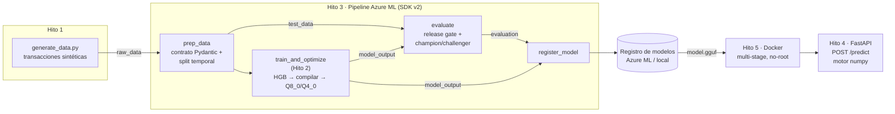

# Detección de fraude: pipeline MLOps (Azure ML SDK v2) + servidor de inferencia cuantizado

Proyecto de referencia de extremo a extremo para un clasificador de fraude con tarjeta:

- **Datos**: generador sintético de transacciones con patrones de ataque realistas.
- **Entrenamiento + optimización**: gradient boosting con scikit-learn, compilado a un formato
  denso y **cuantizado con los kernels Q8_0/Q4_0 de ggml dentro de un contenedor GGUF v3**.
- **Pipeline MLOps**: `prep → train+quantize → evaluate → register` con el **SDK v2 de Azure ML**
  (`azure-ai-ml`), validable offline y ejecutable localmente desde la misma definición.
- **Servicio**: FastAPI + Pydantic estricto; motor de inferencia **solo con numpy**
  (sin scikit-learn/scipy/pandas en producción).
- **Empaquetado**: Dockerfile multi-stage, usuario no-root, healthcheck, sin `pip` en runtime.

Todo lo descrito se ha ejecutado en este entorno; las cifras de abajo son reales y
reproducibles (semillas fijas, 4 vCPU).

| | Resultado |
|---|---|
| Calidad (test out-of-time, 40 000 transacciones, 2,04 % fraude) | ROC-AUC **0,955** · PR-AUC **0,817** · recall **0,79** con precisión **0,81** y 1,98 % de alertas |
| Modelo servido (Q8_0) vs referencia float64 | mismo ROC-AUC/PR-AUC (Δ ≤ 0,0002) · 99,97 % de transacciones en la misma banda de riesgo |
| Huella del modelo | **65 KB** en disco (vs 947 KB, 14,5×) · **77 KB** residentes (vs 884 KB, 11,4×) |
| Inferencia de 1 transacción | **0,15 ms** (vs 2,3 ms scikit-learn) |
| API (500 peticiones, 1 transacción) | p50 **2,1 ms** · p99 **3,6 ms** · máximo **4,4 ms** (SLO: < 200 ms) |
| Imagen Docker | capa de dependencias de 92 MB sobre `python:3.11-slim` |
| Calidad de código | 81 tests (≈17 s) · `ruff check` + `ruff format` limpios |

---

## Arquitectura



Principios de diseño:

1. **Un único contrato de datos** (`src/fraud_detection/schema.py`, Pydantic estricto). Valida las
   filas de entrenamiento en el paso `prep_data` **y** las peticiones de la API.
2. **Un único featurizador** (`features.py`) para entrenamiento y servicio: no hay *skew* por
   construcción (hay un test que compara ambos caminos bit a bit).
3. **Una única definición del pipeline**: los mismos componentes `command()` se validan con el
   SDK, se envían a Azure ML o se ejecutan localmente.
4. **El artefacto servido es el que se evalúa**: `evaluate` puntúa el `model.gguf` con el motor
   de producción, no el modelo de scikit-learn.

### Estructura del repositorio

```
├── mlops_pipeline.py            # Hito 3: pipeline Azure ML SDK v2 (modos azure/validate/local)
├── src/                         # snapshot de código que sube cada componente de Azure ML
│   ├── generate_data.py         # Hito 1: dataset sintético
│   ├── prep_data.py             # paso 1: contrato de datos + split temporal
│   ├── train_and_optimize.py    # Hito 2 / paso 2: entrenamiento + compilación + cuantización
│   ├── evaluate.py              # paso 3: métricas, slices, gate de release, champion/challenger
│   ├── register_model.py        # paso 4: registro (Azure ML o local)
│   └── fraud_detection/         # librería compartida (numpy + pydantic)
│       ├── schema.py            #   contrato de datos (Pydantic)
│       ├── features.py          #   featurizador común train/serve
│       ├── quantization.py      #   kernels Q8_0 / Q4_0 (semántica ggml)
│       ├── gguf_io.py           #   lector/escritor GGUF v3
│       ├── runtime.py           #   motor de inferencia GBDT cuantizado
│       ├── metrics.py · registry.py · tracking.py · data_io.py
├── app/                         # Hito 4: FastAPI (main.py, schemas.py, settings.py)
├── scripts/smoke_test.py        # contrato + latencia contra un servidor en marcha
├── tests/                       # 81 tests (pytest)
├── requirements/                # serve.txt · train.txt · azureml.txt · dev.txt (versiones fijadas)
├── Dockerfile · .dockerignore   # Hito 5
├── Makefile · pyproject.toml · .env.example
└── outputs/ · data/             # generados (ignorados por git)
```

---

## Puesta en marcha local

Requisitos: Python 3.11+, `make`; Docker para el Hito 5.

```bash
make install            # crea .venv e instala requirements/dev.txt + el paquete en modo editable
make data               # Hito 1 → data/transactions.csv (200 000 filas, ~3 s)
make train              # Hito 2 → outputs/model/ (model.gguf + variantes + informes, ~12 s)
make pipeline-local     # Hito 3 → ejecuta el pipeline completo en local (~22 s)
make pipeline-validate  # Hito 3 → validación con el SDK + envío simulado (sin red)
make serve              # Hito 4 → API en http://127.0.0.1:8000 (docs en /docs)
make smoke-test         # Hito 4 → (en otra terminal) contrato + latencia < 200 ms
make docker-build       # Hito 5 → imagen fraud-api:1.0.0
make docker-run         # Hito 5 → contenedor en el puerto 8000
make test lint          # 81 tests + ruff
```

`make help` lista todos los targets. Sin `make`, cada target es un comando de una línea
(p. ej. `python mlops_pipeline.py --mode local`).

---

## Hito 1 · Dataset sintético (`src/generate_data.py`)

Simulador por escenarios: el comportamiento legítimo sale de perfiles de cliente (nivel de gasto,
preferencia de canal, actividad, viajes, hábitos nocturnos) y el fraude se inyecta con patrones
de ataque distintos. Incluye lo que hace difícil el problema real:

| Escenario | Qué lo caracteriza | Recall del modelo |
|---|---|---|
| `card_testing` | ráfagas de importes de 0,5–4 € online, alta velocidad | 1,00 |
| `account_takeover` | dispositivo nuevo, logins fallidos, importes ×6, horario nocturno | 0,98 |
| `card_skimming` | tarjeta presente lejos de casa, retiradas altas en cajero | 0,92 |
| `synthetic_identity` | cuentas de < 60 días, clientes jóvenes, bienes revendibles | 0,78 |
| `subtle` | imita el comportamiento del propio cliente | 0,03 |

- **Negativos difíciles**: viajeros, compras grandes legítimas, móviles nuevos, contraseñas olvidadas.
- **Ruido de etiqueta**: un 3 % del fraude nunca se denuncia (etiquetado como legítimo).
- **Valores ausentes**: estructurales (sin media de 30 días en cuentas de < 30 días) y aleatorios
  (fallos de geolocalización).
- 15 columnas en bruto (10 numéricas, 3 booleanas, 2 categóricas) → 29 features del modelo
  (incluye el ratio importe / media de 30 días y el one-hot de categorías).
- El generador valida una muestra de sus filas contra el contrato Pydantic de la API (los
  tests validan todas).

El escenario `subtle` es casi indetectable a propósito: fija un techo de recall realista y hace
visible por qué conviene evaluar por segmentos.

## Hito 2 · Entrenamiento y optimización (`src/train_and_optimize.py`)

1. **Split temporal** (*out-of-time*): se entrena con el pasado; el 15 % más reciente sirve para
   elegir umbrales y como gate de la cuantización.
2. **Modelo base**: `HistGradientBoostingClassifier` (log-loss, sin `class_weight` para mantener
   probabilidades calibradas; early stopping).
3. **Umbrales operativos**: `decision` (máximo F2: un fraude no detectado cuesta más que una
   falsa alarma) y `review`, que añade como máximo un 3 % del tráfico a una banda de
   autenticación reforzada (3-D Secure). La API devuelve `risk_level` = `low` / `medium` / `high`.
4. **`optimize_model()`**, la función de cuantización y compresión:
   - **Compilación a layout denso**: cada árbol se reescribe como árbol binario perfecto en orden
     BFS (hijos en `2i+1`/`2i+2`), sin punteros; las ramas cortas se rellenan con nodos
     "siempre a la izquierda". Todos los árboles se evalúan a la vez con `D` pasos vectorizados.
   - **Cuantización de entradas sin pérdida**: cada feature se convierte en un bin `uint8` usando
     solo los puntos de corte que usan los árboles. Es exacto porque
     `x <= edge[b] ⇔ searchsorted(edges, x) <= b`; el bin 255 codifica el valor ausente.
   - **Cuantización de hojas** (la única parte con pérdida): F32, F16, **Q8_0** y **Q4_0**,
     bloques de 32 valores con escala fp16, **bit a bit idénticos a la implementación de
     referencia de ggml** (lo verifica un test contra `gguf-py` de llama.cpp). Las hojas siguen
     comprimidas en RAM y solo se decuantizan las visitadas, como hace ggml.
   - **Contenedor GGUF v3 real** (no un mock): cabecera, metadatos tipados (umbrales, huella del
     esquema, métricas) y tensores alineados. El lector oficial `gguf.GGUFReader` lo parsea.
     llama.cpp no puede *ejecutarlo* porque la arquitectura `gbdt` es propia de este proyecto.
   - **Gate de fidelidad y selección**: cada variante se guarda, se recarga y se compara con la
     referencia float64. Se elige la más pequeña que cumple ΔROC-AUC ≤ 0,002, ΔPR-AUC ≤ 0,005 y
     **≥ 99,9 % de transacciones en la misma banda de riesgo**.

Resultados (ejecución del pipeline, 263 árboles, validación de 24 000 filas):

| Variante | Disco | RAM residente | Reducción de RAM | ΔROC-AUC | ΔPR-AUC | Misma banda de riesgo | máx. \|Δp\| | 1 fila | Gate |
|---|---:|---:|---:|---:|---:|---:|---:|---:|:---:|
| Referencia sklearn fp64 | 946 559 B | 884 KB | 1× | — | — | — | — | 2,32 ms | — |
| F32 | 114 688 B | 127 KB | 7,0× | 0,00000 | 0,00000 | 100 % | 0,0000 | 0,14 ms | ✅ |
| F16 | 81 024 B | 93 KB | 9,5× | 0,00000 | 0,00000 | 100 % | 0,0002 | 0,14 ms | ✅ |
| **Q8_0 (servido)** | **65 280 B** | **77 KB** | **11,4×** | +0,00002 | +0,00015 | 99,97 % | 0,0053 | **0,15 ms** | ✅ |
| Q4_0 | 56 864 B | 69 KB | 12,8× | +0,00002 | −0,00097 | 99,70 % | 0,0937 | 0,15 ms | ❌ |

**¿Por qué Q4_0 se rechaza?** Su ROC-AUC es igual y coincide en el 99,98 % de las decisiones de
bloqueo, pero cambia la banda de riesgo (aprobar / reforzar / bloquear) de un **0,3 %** de las
transacciones: el umbral de revisión (≈0,02) cae en una zona densa de probabilidad. A un millón de
transacciones diarias serían unas 3 000 personas tratadas distinto que con el modelo validado, a
cambio de solo 8 KB de ahorro. La primera versión del gate solo medía la decisión binaria; se
amplió a las tres bandas porque la API las expone todas. Q4_0 sigue disponible con
`--quantization q4_0`.

**Trade-off conocido**: en lotes grandes offline (1 000 filas) scikit-learn es ~3× más rápido
(Cython + OpenMP). El motor numpy está optimizado para la inferencia online de pocas filas, que
es el caso de uso del servicio.

Artefactos en `outputs/model/`: `model.gguf` (servido), `variants/*.gguf`,
`baseline_model.joblib` (referencia para auditoría y paridad), `optimization_report.json` y
`training_summary.json`.

## Hito 3 · Pipeline MLOps con Azure ML SDK v2 (`mlops_pipeline.py`)

```
prep_data ──► train_and_optimize ──► evaluate ──► register_model
    └───────────── test_data ────────────┘
```

- **Componentes** `command()` con inputs y outputs tipados (`uri_file`/`uri_folder`/`number`/
  `string`), código en `./src` (con `.amlignore`) y encadenados con `@dsl.pipeline`.
- **Entorno reproducible**: imagen base de Azure ML fijada por tag fechado
  (`openmpi5.0-ubuntu24.04:20260920.v1`) y dependencias pip fijadas leídas de
  `requirements/azureml.txt` (una sola fuente de verdad). El entorno es anónimo, así que Azure ML
  lo identifica por contenido y solo lo reconstruye si cambian las dependencias.
- **Cómputo serverless** por defecto (`--compute cpu-cluster` crea o usa un clúster `AmlCompute`
  con escalado a 0).
- **`evaluate` y `register_model`** se ejecutan con `identity: user_identity` (token
  *on-behalf-of*) y con `is_deterministic=False`: leen el registro de modelos, así que su
  resultado nunca debe reutilizarse de la caché.
- **Gate de release** en `evaluate`: ROC-AUC ≥ 0,90, PR-AUC ≥ 0,60, recall ≥ 0,70, tasa de
  alertas ≤ 5 %, p99 de latencia ≤ 50 ms y fidelidad frente a la referencia. **Champion/challenger**:
  el campeón (última versión registrada) se **vuelve a puntuar sobre el mismo test**, así la
  comparación es justa. `register_model` solo registra si el gate pasa.
- **Métricas en Azure ML Studio** vía MLflow (`fraud_detection/tracking.py`). Fuera de Azure ML
  no hace nada.

### Modos de ejecución

| Comando | Qué hace | Red |
|---|---|---|
| `python mlops_pipeline.py` (`--mode azure`) | valida y envía al workspace. **Sin credenciales, no falla**: registra el motivo y hace un *dry run* (exit 0). Con `--strict`, devuelve exit 2. | Azure |
| `--mode validate` | validación con las APIs públicas del SDK + envío simulado | no |
| `--mode local` | ejecuta **la misma definición** en esta máquina | no |

Cómo se valida la sintaxis del SDK sin credenciales:

1. **APIs públicas de validación con un `MLClient` offline** (credencial que nunca autentica):
   `ml_client.components.validate()` comprueba cada componente (bindings `${{inputs.x}}` del
   comando) y `ml_client.jobs.validate()` el grafo (esquema, inputs obligatorios, bindings entre
   pasos). Hacen falta las dos: se comprobó que `jobs.validate` sola **no** detecta un placeholder
   no declarado dentro de un componente. Con un clúster con nombre, solo su resolución se deja
   para el envío real.
2. **Dry run con un `MLClient` "autospec estricto"**: un mock que reproduce las firmas reales de
   `JobOperations`, `ComputeOperations`, etc. Además rechaza los kwargs que el método real no
   declara. Hace falta porque los métodos del SDK aceptan `**kwargs` y un `create_autospec`
   normal dejaría pasar erratas como `experiment=` en lugar de `experiment_name=`.
3. **Ejecución local fiel**: el job se serializa con `PipelineJob.dump()`. Los comandos de cada
   componente se renderizan igual que en Azure ML (sustituyendo `${{inputs.*}}` y
   `${{outputs.*}}`) y se ejecutan en orden topológico con `src/` como directorio de trabajo.
   Así se prueba de verdad el cableado del pipeline, no una copia.
4. `try/except` alrededor de la autenticación y del envío (`AzureError`,
   `CredentialUnavailableError`…), para que la sesión nunca termine con una traza.

Cada ejecución deja `outputs/pipeline/pipeline_job.yml` (definición serializada, útil para
revisarla en un PR). Una ejecución local deja `outputs/pipeline_runs/<id>/` (salidas y log de
cada paso, `run_summary.json`) y registra en `outputs/registry/<modelo>/<versión>/`.

### Inyectar credenciales para la nube

1. **Workspace** (lo que tenga más prioridad gana):
   - flags `--subscription-id --resource-group --workspace`;
   - variables `AZURE_SUBSCRIPTION_ID`, `AZURE_RESOURCE_GROUP`, `AZUREML_WORKSPACE_NAME`
     (plantilla en `.env.example`: `cp .env.example .env`, rellénala y cárgala con
     `set -a && source .env && set +a`);
   - `config.json` descargado del portal ("Download config.json") en la raíz,
     `.azureml/config.json` o `--config ruta`.
2. **Autenticación**: `DefaultAzureCredential`, sin secretos en el código:
   - en local: `az login`;
   - en CI/CD (recomendado): **federación de identidad OIDC** (`azure/login@v2` en GitHub
     Actions con `client-id`/`tenant-id`/`subscription-id`, sin secreto);
   - service principal con `AZURE_TENANT_ID`, `AZURE_CLIENT_ID` y `AZURE_CLIENT_SECRET`, solo
     como último recurso y desde un gestor de secretos;
   - dentro de Azure: identidad administrada.
3. **RBAC**: la identidad que envía el pipeline necesita el rol **AzureML Data Scientist** en el
   workspace. `evaluate` y `register_model` actúan en su nombre (*on-behalf-of*) para leer y
   registrar modelos. Como alternativa, se puede usar la identidad administrada del clúster
   (`DEFAULT_IDENTITY_CLIENT_ID`); ver `fraud_detection/registry.py`.
4. Envío: `make pipeline-azure` (equivale a `--mode azure --strict --stream`).

`.env`, `config.json` y `.azureml/` están en `.gitignore`.

## Hito 4 · Servidor de inferencia (`app/`)

| Endpoint | Descripción |
|---|---|
| `POST /predict` | lote de 1–1 000 transacciones → probabilidad, `is_fraud` y `risk_level` |
| `GET /model` | versión (hash del contenido), cuantización, tamaño, umbrales, métricas de validación |
| `GET /health/live` · `GET /health/ready` | sondas de liveness y readiness |
| `GET /docs` | OpenAPI (se desactiva con `FRAUD_API_DOCS_ENABLED=false`) |

- **Pydantic estricto**: `extra="forbid"`, sin coerciones (`"12.5"` no es un número y `1` no es
  un booleano), rangos, enums y reglas entre campos (`txn_count_24h ≥ txn_count_1h`, no hay
  `card_present` online). Cualquier violación devuelve **422**. La respuesta también es un
  modelo validado.
- **Arranque fail-fast**: si el modelo no existe, está corrupto o su huella de esquema no coincide
  con el featurizador del servicio, el proceso no llega a estar *ready*.
- **Observabilidad**: `x-request-id` (se propaga o se genera), cabecera `server-timing` y logs
  JSON estructurados.
- Configuración con variables `FRAUD_API_*` (pydantic-settings; ver `.env.example`).

```bash
curl -s -X POST http://127.0.0.1:8000/predict \
  -H 'content-type: application/json' -d @scripts/sample_request.json
```
```json
{
  "model_name": "fraud-detection-gbdt",
  "model_version": "b99f4ef2024c",
  "quantization": "Q8_0",
  "decision_threshold": 0.1291162658393447,
  "review_threshold": 0.022403405087990057,
  "predictions": [
    {"transaction_id": "txn-suspicious", "fraud_probability": 0.99064, "is_fraud": true, "risk_level": "high"},
    {"transaction_id": "txn-regular", "fraud_probability": 0.003055, "is_fraud": false, "risk_level": "low"}
  ],
  "inference_ms": 0.552
}
```

Validación de latencia: `scripts/smoke_test.py` (solo librería estándar) comprueba readiness,
contrato, 6 tipos de payload inválido (esperando 422) y 500 peticiones consecutivas. Resultado:
p50 2,1 ms · p99 3,6 ms · máximo 4,4 ms en local; p50 2,4 ms · p99 3,7 ms dentro de Docker.
`curl` mide 5 ms de extremo a extremo, incluida la conexión TCP.

## Hito 5 · Docker (`Dockerfile`)

- **Multi-stage**: `builder` instala `requirements/serve.txt` (solo wheels, con caché de pip de
  BuildKit) en un venv, elimina las suites de tests y **desinstala pip/setuptools**. `runtime`
  copia solo el venv, `app/`, `src/fraud_detection/` y el `model.gguf`.
- La imagen **no contiene scikit-learn, scipy, pandas ni pip**: la capa de dependencias pesa 92 MB,
  de los que numpy y OpenBLAS son 56 MB.
- El build **verifica el modelo** (lo carga y comprueba la huella del esquema): un artefacto
  incorrecto rompe el build, no el despliegue.
- Usuario **no-root** (uid 10001), `HEALTHCHECK` sobre `/health/ready` y cierre ordenado con
  SIGTERM (0,4 s, exit 0). El número de workers se ajusta con `WEB_CONCURRENCY`.
- `.dockerignore` en modo *allowlist*: el contexto solo contiene lo que la imagen necesita.

```bash
make docker-build                         # usa outputs/model/model.gguf
docker build --build-arg MODEL_PATH=outputs/registry/fraud-detection-gbdt/2/model.gguf -t fraud-api:2 .
make docker-build PIP_CA=/ruta/ca.crt      # detrás de un proxy con inspección TLS (secreto BuildKit, no queda en ninguna capa)
docker run --rm -p 8000:8000 fraud-api:1.0.0
```

## Tests

`make test` ejecuta 81 tests en ≈17 s sobre un dataset de 40 000 filas generado por sesión:

- **Kernels Q8_0/Q4_0 bit a bit idénticos** a `gguf-py` (llama.cpp) en 5 distribuciones, incluidos
  empates de redondeo; ficheros GGUF parseados por el lector oficial; ficheros corruptos rechazados.
- **Compilador exacto**: en float64, el modelo compilado reproduce a scikit-learn (≤ 1e-9) con
  NaN inyectados, valores fuera de rango y entradas justo en cada punto de corte (y en su
  `nextafter`).
- **Paridad train/serve**: featurizador pandas ≡ featurizador de objetos Pydantic, y predicción
  online (API) ≡ puntuación por lotes.
- **Contrato**: casos de coerción, rangos, enums, campos extra y reglas entre campos.
- **Pipeline**: grafo y bindings, entorno fijado, validación offline, detección de errores de
  componente y de grafo, firma estricta del dry run, `main()` sin credenciales (exit 0, y exit 2
  con `--strict`) y **ejecución local completa del pipeline**.
- **Pasos**: cuarentena de filas inválidas, presupuesto de calidad de datos, gate de release,
  champion/challenger (v1 → v2), registro omitido si el gate falla, backends de registro local y
  Azure (API `ModelOperations` simulada).
- **API**: 422 en 7 tipos de payload inválido, `x-request-id`, fail-fast sin modelo o con esquema
  incompatible, latencia < 200 ms.

## Siguientes pasos para producción

- **Desplegar la imagen** en un Azure ML Managed Online Endpoint (contenedor propio), Azure
  Container Apps o AKS. Las sondas y la ruta de scoring ya están expuestas:
  ```python
  env = Environment(
      image="<acr>.azurecr.io/fraud-api:1.0.0",
      inference_config={
          "liveness_route": {"port": 8000, "path": "/health/live"},
          "readiness_route": {"port": 8000, "path": "/health/ready"},
          "scoring_route": {"port": 8000, "path": "/predict"},
      },
  )
  ml_client.online_endpoints.begin_create_or_update(ManagedOnlineEndpoint(name="fraud-api")).result()
  ml_client.online_deployments.begin_create_or_update(
      ManagedOnlineDeployment(
          name="blue",
          endpoint_name="fraud-api",
          environment=env,
          instance_type="Standard_DS2_v2",
          instance_count=2,
      )
  ).result()
  ```
- **CI/CD**: en cada PR, `make lint test pipeline-validate docker-build`; en `main`,
  `pipeline-azure` con OIDC, y despliegue blue/green condicionado al registro de una versión.
- **Monitorización**: drift de features y de la tasa de alertas, y retraso de etiquetas
  (los chargebacks llegan semanas después).
- **Datos reales**: sustituir el generador por un data asset versionado
  (`--raw-data azureml:transactions:3`). El resto del pipeline no cambia.

> **Nota honesta**: no hay credenciales de Azure en este entorno, así que el envío real a un
> workspace no se ha ejecutado. El pipeline se ha validado con las APIs públicas de validación del
> SDK, con un dry run de firmas estrictas y ejecutando su definición completa en local.
