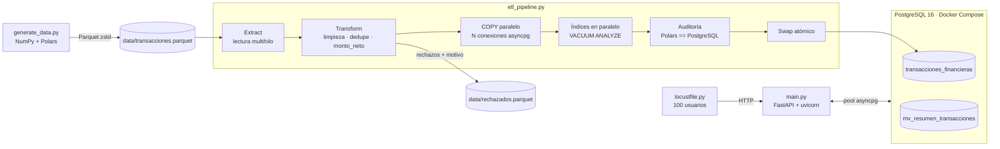

# Pipeline ETL concurrente + API de alta velocidad

Pipeline de datos de punta a punta sobre transacciones financieras sintéticas:
**1.001.000 filas** generadas con Polars, limpiadas y cargadas en PostgreSQL 16
en **3,2 s**, y servidas por una API asíncrona (FastAPI + asyncpg) que sostiene
**más de 4.100 peticiones/s con 100 usuarios concurrentes y 0 errores**.

| Métrica | Resultado medido |
|---|---|
| Dataset sintético | 1.001.000 filas → Parquet zstd de 10,2 MB en ~1 s |
| ETL completo (lectura → limpieza → carga → índices → auditoría → publicación) | **3,22 s** |
| Carga masiva (`COPY` en paralelo, 4 conexiones) | **918.000 filas/s** |
| API bajo estrés (100 usuarios, 30 s, sin pausas entre peticiones) | **4.143 RPS**, 0 fallos · p50 20 ms · p95 39 ms · p99 60 ms |
| API con carga moderada (100 usuarios, ~100 RPS) | p50 2 ms · p95 3 ms · p99 3 ms (régimen estable) |
| Publicación de una nueva carga con la API en producción | 9.454 peticiones durante el ETL → 100 % HTTP 200 |
| Tests | 23 (reglas del ETL + integración de la API) |

---

## Arquitectura



| Capa | Tecnología | Responsabilidad |
|---|---|---|
| Infraestructura | Docker Compose · PostgreSQL 16 | Base de datos afinada para carga masiva y lecturas de baja latencia |
| Generación | Polars + NumPy | 1M+ transacciones con distribuciones realistas y defectos controlados |
| ETL | Polars (multihilo, vectorizado) + asyncpg (`COPY`) | Limpieza, cálculo de impuestos y carga concurrente con publicación atómica |
| API | FastAPI + uvicorn (uvloop, httptools) + asyncpg | Endpoints asíncronos sobre un pool de conexiones |
| Pruebas de carga | Locust (`FastHttpUser`) | 100 usuarios concurrentes en modo headless |

### Estructura del repositorio

```
├── docker-compose.yml        # PostgreSQL 16 afinado                         (Hito 1)
├── init_db.py                # Crea tabla, índices y vista de resumen        (Hito 1)
├── db_schema.py              # DDL compartido: única fuente de verdad del esquema
├── config.py                 # Configuración por variables de entorno
├── generate_data.py          # Dataset sintético → Parquet                   (Hito 2)
├── etl_pipeline.py           # Pipeline ETL concurrente                      (Hito 3)
├── main.py                   # API FastAPI                                   (Hito 4)
├── locustfile.py             # Escenario de carga                            (Hito 5)
├── scripts/run_load_test.sh  # API en segundo plano + Locust headless        (Hito 5)
├── tests/                    # pytest: reglas del ETL e integración de la API
├── results/                  # Logs, métricas y CSV de las ejecuciones documentadas
├── Makefile                  # Orquestación (make all)
├── requirements.txt          # Dependencias con versiones fijadas
└── .env.example              # Variables de entorno opcionales
```

---

## Cómo levantar el proyecto localmente

**Requisitos:** Docker con Compose v2+, Python 3.11+, `curl` y (opcional) `make`.

```bash
make setup    # crea .venv e instala requirements.txt
make all      # up → init → data → etl → test → loadtest
```

`make help` lista todos los objetivos. El equivalente paso a paso, sin `make`:

```bash
python3 -m venv .venv && . .venv/bin/activate && pip install -r requirements.txt

docker-compose up -d          # PostgreSQL 16 (con Compose v2+ también: docker compose up -d)
python init_db.py             # tabla + índices + vista de resumen (idempotente; --reset para recrear)
python generate_data.py       # 1.001.000 filas → data/transacciones.parquet (--filas, --usuarios, --semilla)
python etl_pipeline.py        # limpieza + carga concurrente; imprime el tiempo de cada fase
pytest -v                     # 23 tests

# API (documentación interactiva en http://127.0.0.1:8000/docs)
uvicorn main:app --host 127.0.0.1 --port 8000 --workers 4 --no-access-log

# Prueba de carga: el script levanta su propia API en segundo plano,
# así que detén antes la del paso anterior (usa el puerto 8000).
./scripts/run_load_test.sh    # USERS, DURATION, API_WORKERS... configurables por entorno
```

Todas las variables son opcionales (ver `.env.example`). Si Docker Hub limita las
descargas (HTTP 429), usa el mirror oficial de Google:
`POSTGRES_IMAGE=mirror.gcr.io/library/postgres:16 docker-compose up -d`.

---

## Hito 1 · Infraestructura

`docker-compose.yml` levanta PostgreSQL 16 publicado solo en `127.0.0.1`, con
healthcheck (`pg_isready`) y parámetros afinados para esta carga: `shared_buffers=1GB`
(tabla e índices, ~150 MB, caben en memoria), `maintenance_work_mem=1GB` y 4 workers
paralelos para construir índices, `max_wal_size=4GB` para evitar checkpoints en
mitad de la carga, `jit=off` para latencia predecible y `shm_size: 1g` para las
consultas paralelas.

`init_db.py` crea el esquema de forma idempotente (reintenta la conexión mientras
el contenedor arranca). El DDL vive en `db_schema.py`, que el ETL reutiliza.

| Columna | Tipo | Restricciones |
|---|---|---|
| `id` | `BIGINT` | `PRIMARY KEY` |
| `fecha` | `TIMESTAMPTZ` | `NOT NULL` (UTC) |
| `usuario_id` | `INTEGER` | `NOT NULL` |
| `monto` | `NUMERIC(14,2)` | `CHECK (monto > 0)`: nunca `float` para dinero |
| `monto_neto` | `NUMERIC(14,2)` | `CHECK (0 <= monto_neto <= monto)`: lo calcula el ETL |
| `tipo_transaccion` | `TEXT` | `CHECK` en COMPRA, DEPOSITO, RETIRO, TRANSFERENCIA, PAGO_SERVICIO |
| `estado` | `TEXT` | `CHECK` en COMPLETADA, PENDIENTE, FALLIDA, REVERTIDA |

- Índice `(usuario_id, fecha DESC, id DESC)`: sirve el historial de un usuario ya ordenado.
- Vista materializada `mv_resumen_transacciones`: `GROUP BY ROLLUP (tipo_transaccion)`
  precalcula el total global y el desglose por tipo, así `/resumen` lee 6 filas en
  lugar de agregar un millón en cada petición.

## Hito 2 · Dataset sintético

`generate_data.py` usa NumPy para los números aleatorios (reproducibles con `--semilla`)
y Polars para ensamblar y escribir el Parquet:

- **Distribuciones realistas:** fechas uniformes en 2025 con `id` creciente en el
  tiempo, 10.000 usuarios con actividad log-normal (unos pocos concentran muchas
  transacciones) y montos log-normales por tipo.
- **Defectos controlados**, para que la limpieza tenga trabajo real: montos nulos
  (0,5 %) y negativos (0,1 %), tipos nulos (0,3 %) o mal escritos como `" compra "`
  (1 %), estados nulos (1 %), usuarios nulos (0,2 %), fechas nulas (0,1 %) y
  1.000 registros duplicados.

Resultado: 1.001.000 filas en 0,86 s y Parquet (`zstd`) de 10,2 MB escrito en
0,09 s (`results/generate_data.log`).

## Hito 3 · Pipeline ETL concurrente

### Transformación (Polars, vectorizada)

1. **Normalización:** `tipo_transaccion` y `estado` pasan por `strip` + mayúsculas (9.870 tipos corregidos).
2. **Deduplicación** por clave de negocio: se conserva la primera aparición de cada `id`.
3. **Rechazo con motivo** de las filas no cargables (usuario, fecha, monto o tipo nulos;
   monto ≤ 0; tipo o estado fuera de dominio). Se guardan en `data/rechazados.parquet`
   para auditoría, no se descartan en silencio.
4. **Imputación:** un `estado` nulo se asume `PENDIENTE` (9.939 filas). Es el criterio
   conservador: nunca se da por completada una transacción sin confirmación.
5. **`monto_neto = monto − redondeo_half_up(monto × tasa)`** según el tipo:

   | Tipo | Tasa | Concepto |
   |---|---|---|
   | COMPRA | 16 % | IVA |
   | PAGO_SERVICIO | 5 % | Tasa sobre servicios |
   | RETIRO | 1,5 % | Comisión por retiro |
   | TRANSFERENCIA | 0,4 % | Gravamen a movimientos financieros (4x1000) |
   | DEPOSITO | 0 % | Exento |

   El cálculo usa **aritmética entera en centavos** con redondeo HALF-UP explícito.
   Evita `float` y también el `Decimal` de Polars, cuya multiplicación redondea
   *half-to-even* (0,125 → 0,12). Los tests cubren los casos de medio centavo
   exacto, como 0,10 en PAGO_SERVICIO → 0,09, y comparan 20.000 montos aleatorios
   contra `decimal.ROUND_HALF_UP`.
6. **Orden físico por `(usuario_id, fecha)`:** el historial de un usuario queda en
   páginas contiguas y la consulta de la API lee unas **5 páginas de 8 KB (~0,3 ms
   en PostgreSQL)**.

### Carga: *write-audit-publish*

1. **COPY en paralelo** sobre una tabla de carga *sin índices*. N trabajadores asyncio,
   cada uno con su conexión. La serialización CSV de cada lote de 50.000 filas corre
   en un hilo, y como Polars libera el GIL, mientras un trabajador serializa los demás
   envían datos.
2. **Índices después de cargar**, más rápido que mantenerlos fila a fila: los dos se
   construyen a la vez y el índice único se promueve a PK con
   `ADD CONSTRAINT … USING INDEX` (solo catálogo). Después, `VACUUM ANALYZE`.
3. **Auditoría:** el número de filas y las sumas exactas de `monto` y `monto_neto` en
   PostgreSQL deben coincidir al centavo con las calculadas por Polars. Si no, la
   carga se aborta **sin publicar**.
4. **Swap atómico:** en una transacción corta (con `lock_timeout`), la tabla de carga y
   su vista de resumen sustituyen a las productivas. La API nunca ve datos a medio
   cargar y una carga fallida no toca los datos vigentes. Verificado: 9.454
   peticiones concurrentes durante una ejecución completa del ETL, 100 % HTTP 200.

Salvaguarda adicional: si no queda ninguna fila válida (origen vacío o corrupto), el
ETL aborta antes de tocar la base de datos en lugar de publicar una tabla vacía.

### Resultados (`results/etl_run.log`, `results/etl_metrics.json`)

| Fase | Tiempo |
|---|---:|
| Extract: lectura del Parquet | 0,052 s |
| Transform: limpieza + dedupe + `monto_neto` | 0,601 s |
| Load: preparar tabla de carga | 0,007 s |
| Load: `COPY` paralelo (4 conexiones, 75,9 MB de CSV) | 1,076 s |
| Load: índices en paralelo + PK | 0,634 s |
| Load: `VACUUM ANALYZE` | 0,270 s |
| Load: vista de resumen + auditoría | 0,433 s |
| Load: swap atómico | 0,007 s |
| **Total** | **3,220 s** |

Filas: 1.001.000 leídas → **988.003 cargadas** · 12.997 rechazadas (1,30 %): monto nulo
4.988, tipo nulo 3.026, usuario nulo 1.960, fecha nula 1.040, duplicados 1.000,
monto no positivo 983.

**Escalado de la carga concurrente** (misma máquina de 4 núcleos):

| Conexiones | `COPY` | Filas/s | Aceleración |
|---:|---:|---:|---:|
| 1 | 2,957 s | 334.106 | 1,0× |
| 2 | 1,594 s | 619.949 | 1,9× |
| **4** | **1,047 s** | **943.563** | **2,8×** |
| 8 | 1,159 s | 852.746 | 2,6× |

Por defecto se usan tantas conexiones como núcleos (`os.cpu_count()`); con más
conexiones que núcleos el rendimiento empeora.

## Hito 4 · API asíncrona

| Endpoint | Descripción |
|---|---|
| `GET /api/v1/resumen` | Volumen total de transacciones, monto global y neto, desglose por tipo |
| `GET /api/v1/transacciones/{usuario_id}?limit=100&offset=0` | Historial del usuario, del más reciente al más antiguo (`limit` 1–1000) |
| `GET /health` | Readiness: verifica que la base de datos responde |

Errores: `404` si el usuario no tiene transacciones, `422` si un parámetro no es
válido (incluidos `usuario_id` y `offset` fuera de rango) y `503` si la base de
datos no está disponible.

```console
$ curl -s localhost:8000/api/v1/resumen
{"total_transacciones":988003,"monto_total":191455827.64,"monto_neto_total":186705095.44,
 "actualizado_en":"2026-09-25T05:01:11.299681+00:00","por_tipo":[{"tipo_transaccion":"COMPRA",
 "total_transacciones":395580,"monto_total":23792215.88,"monto_neto_total":19985458.6}, …]}

$ curl -s "localhost:8000/api/v1/transacciones/4321?limit=2"
{"usuario_id":4321,"cantidad":2,"limit":2,"offset":0,"transacciones":[
 {"id":984519,"fecha":"2025-12-26T09:01:02.481559+00:00","monto":406.81,"monto_neto":406.81,"tipo_transaccion":"DEPOSITO","estado":"COMPLETADA"},
 {"id":971656,"fecha":"2025-12-21T15:46:36.545711+00:00","monto":20.31,"monto_neto":17.06,"tipo_transaccion":"COMPRA","estado":"COMPLETADA"}]}
```

**Decisiones de rendimiento.** Cada una está medida, ver [la tabla de optimizaciones](#qué-se-optimizó-y-cuánto-aportó):

- **Pool asyncpg por proceso**, creado en el `lifespan`. Se abre completo al arrancar
  (`min = max`) y cada conexión nueva prepara las consultas de la API antes de recibir
  tráfico. asyncpg usa el protocolo binario y cachea las sentencias preparadas.
- **Sin consulta de reset al devolver conexiones al pool.** El reset por defecto de
  asyncpg (`RESET ALL; UNLISTEN *; …`) cuesta un viaje extra a la base de datos por
  petición, y estos handlers no modifican el estado de la sesión.
- **`/resumen`** lee la vista materializada que el ETL recalcula en cada carga.
- **`/transacciones`**: índice compuesto + clustering físico. PostgreSQL construye el
  JSON del historial (`row_to_json`) y Python lo incrusta con `orjson.Fragment`, sin
  crear ~600 objetos Python por petición. Los montos salen como números JSON exactos.
- **Sin validación de la respuesta en caliente.** Los modelos Pydantic documentan el
  contrato en OpenAPI y los tests de integración verifican que las respuestas lo cumplen.
- **uvicorn** con uvloop + httptools, 4 workers y sin access log.

## Hito 5 · Pruebas de carga

**Escenario** (`locustfile.py`): 100 usuarios virtuales `FastHttpUser`, todos
arrancados en el primer segundo, durante 30 s y **sin tiempo de espera** entre
peticiones: siempre hay 100 peticiones en vuelo. Por cada 5 peticiones, 1 va al
resumen y 4 al historial de un `usuario_id` aleatorio (1–10.000). La API corre en
segundo plano con 4 workers; Locust usa 2 procesos, porque uno solo satura en
~3.100 RPS y pasaría a ser el cuello de botella.

```bash
./scripts/run_load_test.sh   # = locust -f locustfile.py --headless -u 100 -r 100 -t 30s --processes 2 …
```

### Resultados: estrés (`results/locust_console.log`, `results/locust_stats.csv`)

| Endpoint | Peticiones | Fallos | RPS | Media | p50 | p90 | p95 | p99 | p99,9 | Máx |
|---|---:|---:|---:|---:|---:|---:|---:|---:|---:|---:|
| `GET /api/v1/resumen` | 25.001 | 0 | 831,9 | 21,2 ms | 20 | 33 | 38 | 57 | 100 | 137 |
| `GET /api/v1/transacciones/{usuario_id}` | 99.495 | 0 | 3.310,7 | 21,7 ms | 20 | 33 | 39 | 61 | 100 | 148 |
| **Total** | **124.496** | **0 (0,00 %)** | **4.142,7** | **21,6 ms** | **20** | **33** | **39** | **60** | **100** | **148** |

Percentiles en milisegundos. El throughput se mantuvo estable entre 3.500 y 4.262 RPS
durante toda la prueba (`locust_stats_history.csv`), sin un solo fallo.

**Cómo leer la latencia:** la prueba es de bucle cerrado. Por la ley de Little,
100 usuarios / 4.143 RPS ≈ 24 ms, lo mismo que la latencia media observada (21,6 ms).
Es decir, bajo saturación la latencia es casi toda *tiempo en cola*: la API, PostgreSQL
y Locust compiten por los mismos 4 núcleos. El tiempo de servicio real se ve en la
prueba moderada.

### Resultados: carga moderada (`results/carga_moderada/`)

Mismos 100 usuarios, pero con una pausa de 0,5–1,5 s entre peticiones
(`LOCUST_WAIT_MIN=0.5 LOCUST_WAIT_MAX=1.5`): 3.037 peticiones a 101 RPS, 0 fallos.
**En régimen estable (desde t = 15 s): p50 2 ms, p95 3 ms, p99 3 ms.** El p99 global
de la prueba (58 ms) viene solo de los primeros segundos, cuando los 100 usuarios
lanzan su primera petición a la vez mientras Locust arranca en la misma máquina.

### Qué se optimizó y cuánto aportó

El primer perfil de CPU (con `top` y `py-spy`, a ~2.750 RPS) repartía la CPU así:
**uvicorn 51 %, Locust 19 %, PostgreSQL 18 % y `docker-proxy` 11 %**. Cada cambio
se midió con corridas de calibración de 10 s (API con 3 workers + Locust con 2
procesos; ruido aproximado de ±5 %):

| Cambio (acumulativo) | RPS | p50 | p95 | p99 |
|---|---:|---:|---:|---:|
| Línea base | 2.450 | 33 ms | 76 ms | 120 ms |
| Pool sin consulta de reset al liberar conexiones | 3.063 | 24 ms | 69 ms | 110 ms |
| JSON del historial generado en PostgreSQL (`orjson.Fragment`) | 3.231 | 24 ms | 58 ms | 94 ms |
| Sin `docker-proxy`: reenvío del puerto en el kernel | **4.046** | **19 ms** | **43 ms** | **69 ms** |

Además, **abrir el pool completo al arrancar** bajó el p99,9 de 330 a 100 ms (y el
máximo de 348 a 150 ms), porque ya no se abren conexiones con autenticación SCRAM en
mitad de un pico. **Precalentar las sentencias** en cada conexión redujo la primera
petición en frío de 11,5 a 6,9 ms.

> **Nota sobre `docker-proxy` (solo afecta al rendimiento).** Por defecto Docker
> publica `127.0.0.1:5432` con un proxy en espacio de usuario que copia cada paquete:
> consumía el 11 % de la CPU, y quitarlo aumentó el throughput un 25–31 %. En Linux
> se desactiva con `{"userland-proxy": false}` en `/etc/docker/daemon.json` y se
> reinicia Docker; el reenvío pasa a una regla NAT del kernel y el proyecto no cambia.
> Las cifras de este README se midieron así. En Docker Desktop (macOS/Windows) la red
> pasa por una VM y este ajuste no aplica.

## Tests

```bash
pytest -v    # 23 tests en ~1,3 s
```

- `tests/test_etl_transform.py` (sin base de datos): tasas por tipo, redondeo HALF-UP
  en casos de medio centavo, 20.000 montos aleatorios contra `decimal`, motivo de
  rechazo de cada tipo de defecto, deduplicación, imputación, orden de salida y
  la salvaguarda que impide publicar una carga vacía.
- `tests/test_api.py` (integración con PostgreSQL; se omiten si no está disponible):
  contrato de ambos endpoints validado con los modelos Pydantic, cuadre del resumen,
  orden y paginación del historial, 404 y los 422 de validación (incluidos valores
  fuera de rango de `usuario_id` y `offset`).

## Entorno de medición

- **Máquina:** 4 vCPU Intel Xeon @ 2.80 GHz (microVM Firecracker), 15 GB de RAM,
  Ubuntu 24.04, Linux 6.18.
- **Software:** Docker 29.3.1 + Compose v5.1.1, PostgreSQL 16.15, Python 3.11.15,
  Polars 1.44.2, asyncpg 0.31.0, FastAPI 0.141.1, uvicorn 0.53.0, Locust 2.46.6.
- **Todo en la misma máquina:** API, base de datos y generador de carga comparten los
  4 núcleos. Con Locust en otra máquina, la API dispondría de más CPU.
- **Particularidades del entorno cloud donde se ejecutó:**
  - El daemon de Docker no estaba en marcha y se inició con `--userland-proxy=false`.
  - Docker Hub respondía 429 (límite de descargas), así que `postgres:16` se descargó
    de `mirror.gcr.io`: es la misma imagen oficial, con el mismo digest.
  - `docker-compose` apunta al binario de Compose v5.

## Próximos pasos

- Paginación por cursor (*keyset*, sobre `(fecha, id)`) para historiales muy largos.
- Cargas incrementales (`MERGE`) y particionado mensual cuando el volumen crezca
  varios órdenes de magnitud.
- PgBouncer en modo transacción si la API escala a muchas réplicas.
- Observabilidad: métricas Prometheus (histogramas de latencia, saturación del pool) y trazas OpenTelemetry.
- CI con GitHub Actions: tests contra un servicio PostgreSQL en cada PR.
